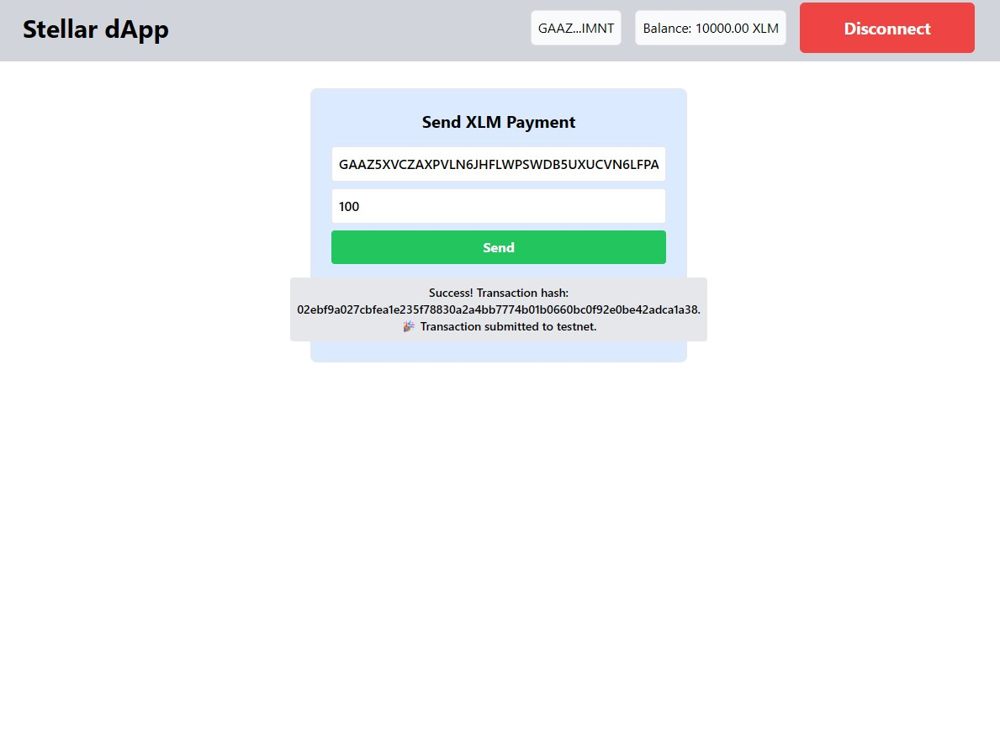

# Stellar White Belt dApp

This repository contains a simple Stellar-based frontend built with React and TailwindCSS that fulfills the requirements for **Level 1 – White Belt** of the Stellar development challenge. The app runs on the **Stellar testnet** and demonstrates wallet integration, balance display, and basic XLM transactions using the Freighter wallet.

> ✨ **Features implemented**
> - Connect & disconnect a Freighter wallet
> - Display connected account’s public key and XLM balance
> - Send XLM payments to any address on testnet
> - Show success/failure feedback and transaction hash

---

## ✅ Requirements Checklist
1. **Wallet Setup**
   - Uses Freighter wallet (Testnet).
   - Prompt for permission when connecting.
2. **Wallet Connection**
   - "Connect Wallet" button triggers Freighter popup.
   - "Disconnect" clears the session.
3. **Balance Handling**
   - Balance is fetched from Horizon and displayed with 2‑decimal precision.
4. **Transaction Flow**
   - Payment form accepts destination and amount.
   - Transaction built, signed in Freighter and submitted to testnet.
   - UI displays success or failure with hash or error message.
5. **Development Standards**
   - Clean React components and error handling.
   - Uses `@stellar/stellar-sdk` and `@stellar/freighter-api`.

---

## 🛠 Technologies Used

- **Frontend**: React.js, TailwindCSS
- **Wallet**: Freighter (Chrome extension)
- **Blockchain SDK**: `@stellar/stellar-sdk`, `@stellar/freighter-api`

---

## 🏁 Getting Started

```bash
# clone the repo
git clone https://github.com/uzochukwuV/stellar-hyperapp.git
cd stellar-hyperapp

# install dependencies
npm install

# start development server
npm run start
```

1. Open http://localhost:3000 in your browser.
2. Install the [Freighter](https://freighter.app/) extension if you haven’t already and switch to **Testnet**.
3. Use the **Connect Wallet** button in the header to authorize the dApp.
4. Once connected, your public key and balance appear.
5. Enter a destination address and amount, then click **Send**.
6. Observe the transaction feedback area for results.

---

## 📸 Screenshots
*(You should replace these with actual screenshots before submission)*

- Wallet connected state
- Balance displayed
- Successful testnet transaction
- Transaction result shown to the user

---

## 📁 File Structure Highlights

- `src/components/Header.js` – connection/disconnection and balance UI
- `src/components/PaymentForm.js` – simple payment workflow
- `src/components/Freighter.js` – Freighter helper functions

---

Good luck with your submission! 🚀


✅ Deployed!
CAGXJUI4GWABBGDQK5XWCYMLBOW77ABCBAAZWI5KXBLQ73FPCD7BDGMG
✅ TX hash!
https://stellar.expert/explorer/testnet/tx/eafe6be42a4cd73f46bb3b22e9ebcec1c631b4de759cd277b0c20d3b9c64db54
✅ Link!
https://stellar-hyperapp.vercel.app/

✅ Video!
https://youtu.be/_GLvslUjLmY

NftMinter.js - Service layer with 3 error types:

WalletNotFoundError (yellow warning)
TransactionRejectedError (blue info)
InsufficientBalanceError (red error)
Transaction status tracking: IDLE → PREPARING → SIGNING → SUBMITTING → PENDING → SUCCESS/FAILED
NFTMinterForm.js - Mint form with image preview and real-time status

NFTGallery.js - Display minted NFTs in a grid

App.js - Updated to include NFT components